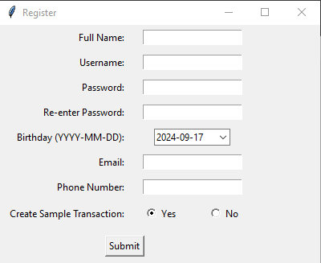

# ĐỒ ÁN: XÂY DỰNG ỨNG DỤNG QUẢN LÝ CHI TIÊU (EXPENSE TRACKING) - NHÓM 2

## THÀNH VIÊN:
| Nhóm   | Mã SV   | Họ và Tên        |
|--------|---------|------------------|
| Nhóm 2 | 22730080 | Huỳnh Công Lập   |
|        | 22730090 | Nguyễn Hoàng Phúc|
|        | 22730075 | Nguyễn Quốc Huy  |
|        | 22730084 | Trần Thanh Nam   |
|        | 22730072 | Nguyễn Phúc Hưng |

## Tổng Quan:
- Ứng dụng này được viết bằng Python sử dụng thư viện Tkinter cho giao diện người dùng đồ họa (GUI).
- Ứng dụng này cho phép người dùng tạo tài khoản, đăng nhập và quản lý dữ liệu tài chính của họ.
- Ứng dụng tập trung vào tính thân thiện với người dùng và cung cấp nhiều chức năng khác nhau để quản lý chi phí.

## Tính Năng:
- `Đăng nhập và Đăng ký`: Người dùng có thể tạo tài khoản và đăng nhập để truy cập dữ liệu tài chính của họ. 
- `Quên mật khẩu`: Cho phép người dùng đăng ký lại mật khẩu
- `Quản lý giao dịch`: Người dùng có thể thêm giao dịch mới, bao gồm các chi tiết như ngày, loại (thu nhập hoặc chi phí), nhóm, tên, số tiền và ghi chú.
- `Chế độ xem tóm tắt`: Cung cấp tổng quan về tổng thu nhập, chi phí và số dư hiện tại. Trình bày biểu đồ biểu diễn xu hướng thu nhập và chi phí theo thời gian.
- `Thống kê`: Phân tích các mô hình chi tiêu bằng cách hiển thị biểu đồ được phân loại dựa trên nhóm giao dịch, tên và ghi chú.
- `Chức năng tìm kiếm`: Người dùng có thể tìm kiếm các giao dịch cụ thể dựa trên các tiêu chí như tên giao dịch, loại, nhóm và phạm vi ngày.
- `Chức năng xóa`: Trong chức năng tìm kiếm, người dùng có thể sử dụng chức năng xóa để xóa giao dịch bị lỗi ra khỏi hệ thống.
- `Thông Tin Cá Nhân`: Người dùng có thể xem thông tin cá nhân và đăng xuất khỏi tài khoản.

## Công Nghệ Sử Dụng:
- `Python`: Ngôn ngữ lập trình chính được sử dụng để phát triển logic ứng dụng.
- `Tkinter`: Một thư viện Python để tạo giao diện người dùng đồ họa.
- `Matplotlib`: Một thư viện Python để tạo hình ảnh dữ liệu như biểu đồ và đồ thị. (Được sử dụng để tạo biểu đồ trong phần Thống kê)
- `Pandas`: Một thư viện Python để phân tích và xử lý dữ liệu. (Có khả năng được sử dụng để xử lý dữ liệu ở chế độ nền)
- `SQLite`: Một hệ thống quản lý cơ sở dữ liệu quan hệ để lưu trữ dữ liệu người dùng. (Có thể triển khai để duy trì dữ liệu)
Lưu ý: Các thư viện cụ thể được sử dụng để tương tác cơ sở dữ liệu và xử lý dữ liệu có thể không được hiển thị rõ ràng trong đoạn mã được cung cấp, nhưng chúng là các thành phần thiết yếu cho một ứng dụng hoạt động đầy đủ.

## Hướng Dẫn Sử Dụng:
- `Đăng nhập`: Nếu bạn là người dùng mới, chức năng đăng ký hiện không khả dụng. Bạn có thể tiếp tục với người dùng được xác định trước hoặc đợi tính năng đăng ký được triển khai.
- `Menu chính`: Ứng dụng cung cấp một menu với nhiều tùy chọn khác nhau để quản lý tài chính của bạn.
- `Tổng hợp` (Tóm tắt): Hiển thị tổng quan về tình hình tài chính và xu hướng hiện tại của bạn.
- `Thêm giao dịch` (Thêm giao dịch): Cho phép bạn ghi lại các giao dịch thu nhập hoặc chi phí mới.
- `Thống kê` (Thống kê): Hiển thị biểu đồ và đồ thị để phân tích các mô hình chi tiêu của bạn.
- `Tìm kiếm giao dịch`: Cho phép bạn tìm kiếm các giao dịch cụ thể dựa trên các tiêu chí khác nhau.
- `Thông tin cá nhân`: Cho phép bạn xem thông tin cá nhân và đăng xuất tài khoản. (Chức năng cập nhật thông tin có thể được nâng cấp trong tương lai)
Sử dụng các tính năng cụ thể: Mỗi phần của menu cung cấp các chức năng cụ thể cho mục đích của nó. Tham khảo các mô tả trên màn hình và chú giải công cụ để biết hướng dẫn trong từng phần.

## Kết Luận:
- Ứng dụng Expense Tracking này cung cấp một công cụ hữu ích cho người dùng để quản lý tài chính hiệu quả. Nó cung cấp các chức năng để ghi lại giao dịch, trực quan hóa dữ liệu và hiểu rõ hơn về thói quen chi tiêu. Với sự phát triển hơn nữa, nó có thể trở thành một công cụ quản lý tài chính cá nhân toàn diện hơn.

## Hình Ảnh Mô Phỏng:
|  |  |  |
|  |  |  |
|  |  |  |
